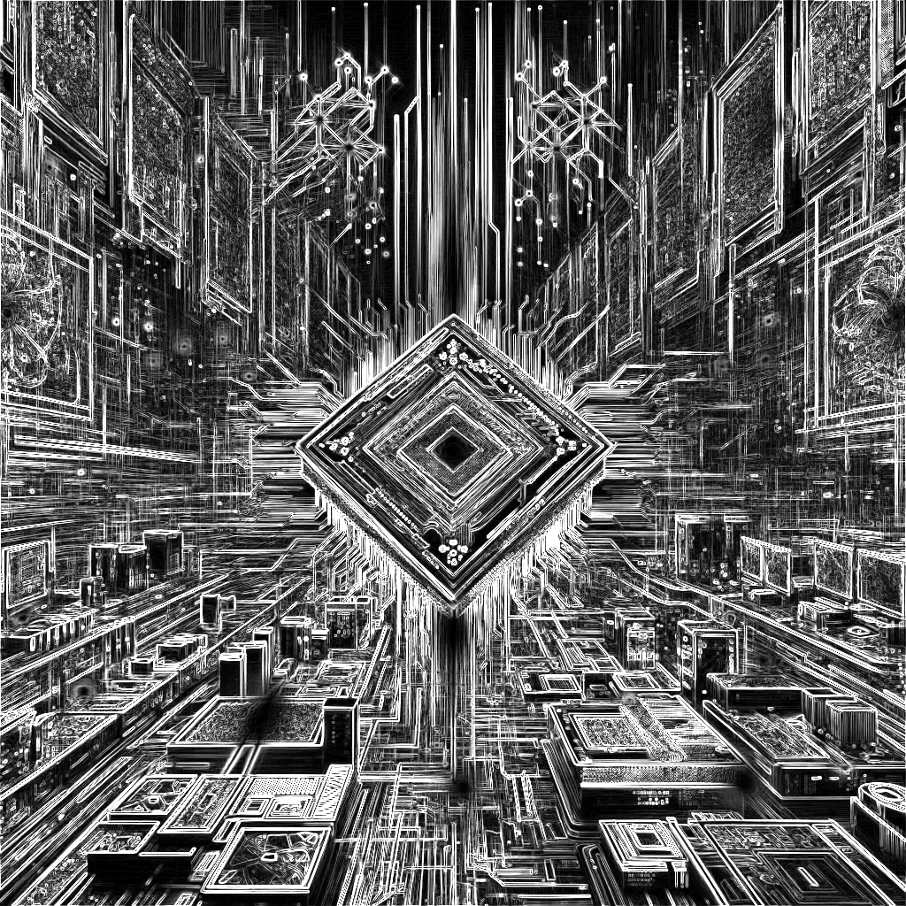

# Convolution

Covers convolutional kernels, caching, and constant memory.

# Part 0: Generating the test data

All parts of the lab will use the same data, so running the following command in the `Conv2D` directory will generate it.

```bash
cmake -B build
cmake --build build
./build/release/conv2d_datagen
```

Running this from the main directory will create a `data` directory at the top level of this project. The tests in `run_tests.sh` are already configured to look for it there.

# Part 1: Basic 2D Convolution

The first part of the folder would implement a basic 2D convolution kernel that supports the same arguments as the given CPU version.

**Arguments**

- `input`: A `float *` array of input data
- `kernel`: A `float *` array of kernel data
- `output`: A `float *` array of output data
- `height`: The height of the input data
- `width`: The width of the input data
- `kernelSize`: The size of the filter, assumed to always be square
- `outputHeight`: The height of the output data
- `outputWidth`: The width of the output data
- `padding`: The padding to use for the convolution
- `stride`: The stride to use for the convolution
- `dilation`: The dilation to use for the convolution

 All you need to do is  set up the data. There are 21 tests provided when creating the data. The variations are set up to test different combinations of padding, stride, and dilation.

## Benchmarking

This code would showcase the benchmark difference and efficiency between each folder. 

# Part 2: Optimizing the Filter Access

The second part of the folder is to load the filter into something other than global memory.

## Constant Memory

Since the kernel should support varying filter sizes. The tests will use no greater than a $5 \times 5$ square filter, NOTE: if changed please remmeber to only allocate enough space for that size.

## Shared Memory

The filter could also be placed into shared memory. This allows for a dynamically sized filter, but it also requires that the filter be loaded into shared memory for each block. In this code we experimented with both constant memory and shared memory to see which is more efficient.

## Benchmarking

NVIDIA Visual Profiler that can be used to analyze the performance of the kernel can be done for all folders

# Part 3: Tiled 2D Convolution

Part 3 of the folder adds tiling to the 2D convolutional kernel. Which is built upon the kernel from part2.

# Part 4: Caching halo cells
NOTE part 4 and 5 are under maintance! they don't work as expected yet! , TO BE DEBUGGED
The final modifying of the 2D convolutional kernel is to cache the halo cells. This is done by adding a 2D array to the shared memory that is the same size as the filter. The halo cells are then copied to the shared memory before the main computation is done.

The idea behind this optimization is that it is highly likely that the halo cells are already in L2 cache, so the tile size is the same for both input and output without any additional memory overhead.

# Part 5: Gradient Image

The final part of the folder is to use the optimized 2D convolutional kernel to compute the gradient image of an input image. The gradient image is computed by convolving the input image with the Sobel filter in the x and y directions. The Sobel filter is a $3 \times 3$ filter that is used to compute the gradient of the image. The x-direction filter is:

$$
\begin{bmatrix}
-1 & 0 & 1 \\
-2 & 0 & 2 \\
-1 & 0 & 1
\end{bmatrix}
$$

The y-direction filter is:

$$
\begin{bmatrix}
-1 & -2 & -1 \\
0 & 0 & 0 \\
1 & 2 & 1
\end{bmatrix}
$$

The gradient image is then computed by taking the square root of the sum of the squares of the x and y gradients. This is then normalized to the range $[0, 1]$.

The easiest way to implement this is to copy over a working version of your 2D convolutional kernel and call it on the input image with both Sobel filters. To be clear, you'll need to call the kernel twice, generating an x-gradient and a y-gradient. The gradient image is then computed from these two images by taking the square root of the sum of the squares of the x and y gradients.

An example of the expected output is shown below:

